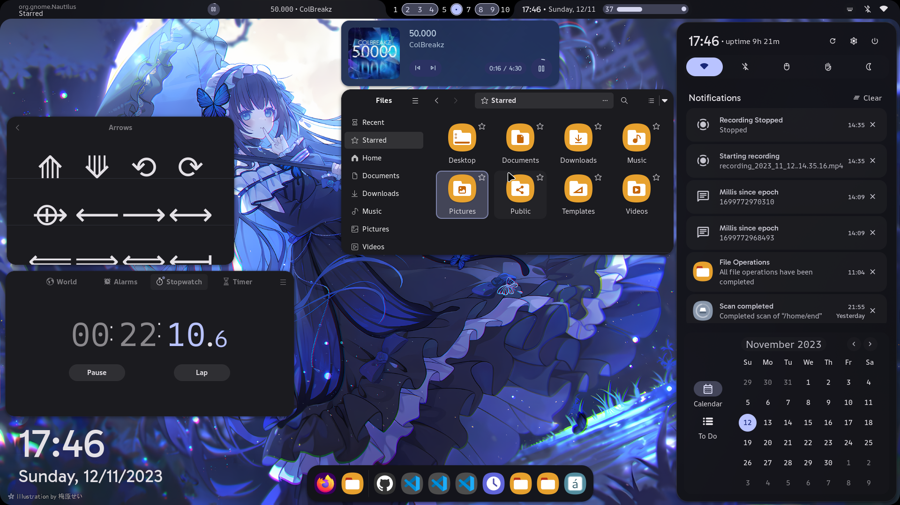

    <h1>【 end_4's Hyprland dotfiles 】</h1>
    <h3></h3>

</a>

# ✨ Cool stuff
 
 
  
Notable features

     
  - Overview widget that shows open apps. Conveniently packed with app search/calculator/command runner
  - Autogenerated colors based on your wallpaper using [Material colors](https://m3.material.io/styles/color/the-color-system/key-colors-tones)
  - Fully animated widgets

 
 
  
Bragging

     
   - [`summer-gruv`](https://github.com/end-4/dots-hyprland/tree/summer-gruv) branch: winner of Hyprland ricing competition Summer 2023, now shown in the [Hyprland repo](https://github.com/hyprwm/hyprland#gallery) and [Hyprland Wiki](https://wiki.hyprland.org/Configuring/Example-configurations/)
   - [`windoes`](https://github.com/end-4/dots-hyprland/tree/windoes) is a "Tasty rice" [on r/unixporn](https://www.reddit.com/r/unixporn/comments/13zdhqd/hyprland_windows_rice_with_too_much_eww_with_blur/)

# 👀 Styles

_Click the images for video showcases with animations! (except illogical\_impulse)_

### [illogical_impulse](https://github.com/end-4/dots-hyprland/tree/illogical-impulse)
   

> [!WARNING]
> Only the above is well maintained. Branches below currently do NOT work (see [#99](https://github.com/end-4/dots-hyprland/issues/99))

### [m3ww](https://github.com/end-4/dots-hyprland/tree/m3ww)
   

### [NovelKnock](https://github.com/end-4/dots-hyprland/tree/novelknock)
   

### [Hybrid](https://github.com/end-4/dots-hyprland/tree/hybrid)
   

### [Windoes](https://github.com/end-4/dots-hyprland/tree/windoes)
   

- For older stuff I never wanna touch again, check the releases

---

# 🔧 General instructions
 - Don't use the main branch! Use one of the above listed ones.
 - **BACKUP**
 - Install dependencies. You can find the list for them in branch-specific readmes.
 - Copy
   - `.config`, `.local` to home folder
   - Folders in `.local/share/icons` to your `/usr/share/icons`
   - Stuff in `Import manually` folder if you need them
 - **For ARM users**: Compile .cpp files in `.config/eww/scripts/` (to that folder) (like this: `g++ ~/.config/ewwscripts/SCRIPTNAME.cpp -o ~/.config/eww/scripts/SCRIPTNAME`)
 - See the wiki for further eww-specific instructions
 
---

# 🙏 Attribution
 - Thank you fufexan (who also thanks a lot more people) for his guidance and a simple, clean [eww config](https://github.com/fufexan/dotfiles) (good start for learning eww on hyprland btw)
 - Copied a lot from [Aylur's dotfiles](https://github.com/Aylur/dotfiles)
 - Thanks to the people at the Hyprland discord server for their inspiration
 - AI bots for providing useful examples
 - Maybe more, but I might not remember them all.. Still, thanks.

# 🌟 stonks
- _thank you_

# 💡 Some inspirations
 - osu!lazer, Windows 11, Material Design 3, AvdanOS (concept)

