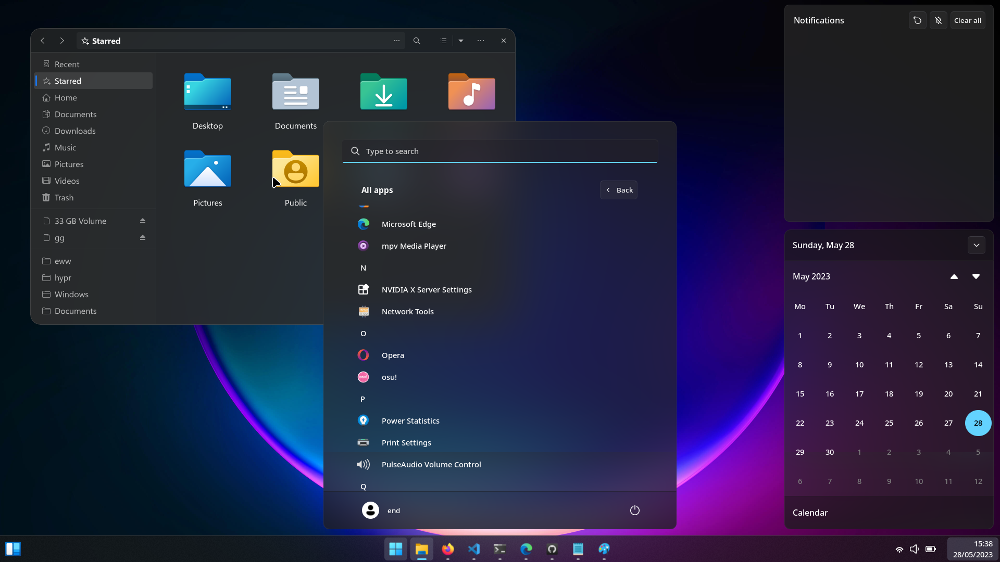

<div align="center">
    <h1>[ end-4/dots-hyprland > windoes branch ]</h1>
    <h3> your colleagues will not freak out now </h3>
</div>

## Features
 - Actually has animations similar to Windows
 - You'll see random anime girls instead of Trump in the Widgets panel
 - The icon size doesn't suck

 # Screenshots
 - A video showing everything: https://cdn.discordapp.com/attachments/1114548683770441738/1114548686400266260/hyprland11_fadeout.mp4
 
 
 
 

## Instructions
 - See the main branch for installation instructions. Dependencies below.
 - Start bar with `eww open winbar`
 - VSCode theme: Community Material Theme Darker, _Hyprland opacity windowrule 0.92_
 - Note that you have to install the Segoe UI Variable font manually

# Dependencies
 - Python dependencies (Command for Arch Linux with `yay` installed)
```
yay -S python-pywal python-desktop-entry-lib python-poetry python-build python-Pill
```
 - Normal dependencies
```
[ Possible package names (Command for Arch Linux) ]
sudo pacman -S bc blueberry bluez boost boost-libs coreutils dunst findutils fuzzel fzf gawk gnome-control-center ibus imagemagick libqalculate light networkmanager network-manager-applet nlohmann-json pavucontrol plasma-browser-integration playerctl procps ripgrep socat sox udev upower util-linux xorg-xrandr wget wireplumber yad
[ Command for: Fedora (INCOMPLETE command; so there's less name hunting for you) ]
sudo dnf install bc blueberry bluez coreutils dunst findutils gawk gojq ImageMagick light NetworkManager network-manager-applet pavucontrol plasma-browser-integration playerctl procps ripgrep socat swayidle swaybg udev upower util-linux wget wireplumber wlogout qalc sox nlohmann-json-devel
```
- AUR Packages (Command for Arch Linux with `yay` installed)
```
yay -S cava eww-wayland-git geticons gojq gtklock gtklock-playerctl-module gtklock-powerbar-module gtklock-userinfo-module hyprland-git python-material-color-utilities swww ttf-material-symbols-git xdg-desktop-portal-hyprland-git waybar-hyprland-git wlogout 
```
- Manual setup
   - Get "Plasma browser integration" extension for your browser
   - Run `usermod -aG video <USERNAME>` for brightness control to work
   - Segoe UI Variable
- Keyring (basically authentication stuff) (Command for Arch Linux)
```
sudo pacman -S gnome-keyring polkit-gnome 
```

 - Utilities that I use (Command for Arch Linux)
```
sudo pamcman -S tesseract cliphist grim slurp
```
